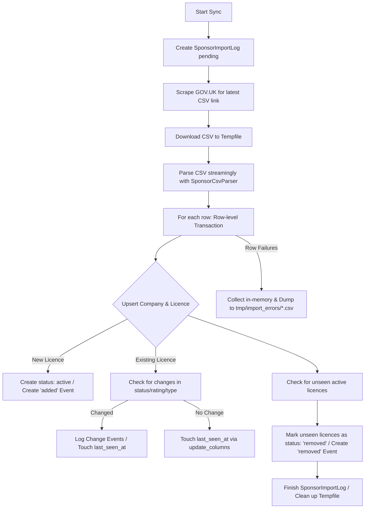

# VisaSponsorCheck

VisaSponsorCheck is a Ruby on Rails application designed to track and monitor the status of licensed UK visa sponsors (companies registered with the UK government to sponsor worker visas). It scrapes official government data, parses updates, logs change histories, and exposes a user-friendly interface to search and inspect sponsors.

---

## What the Application Does

* **Sponsor Registry:** Maintains a searchable database of UK-based companies licensed to sponsor visas.
* **Official Data Scraper:** Scrapes the GOV.UK website dynamically to find and download the latest licensed sponsor worker CSV register.
* **Granular Diff Tracking:** Compares imports against the database, detecting when a sponsor licence is:
  * **Added** to the register.
  * **Removed** from the register.
  * Updated with a new **rating** (e.g. A-rating), **licence type**, or **route** (e.g. Skilled Worker).
* **Historical Audit Log:** Logs each status or detail change as a chronological `SponsorChangeEvent` associated with the company.
* **Resilient Importer:** Uses row-level database transactions and error recovery. Any malformed or failed rows during the sync are skipped, logged, and written to a separate CSV error log, preventing the entire sync run from failing.

---

## Setup & Booting Instructions

### System Requirements
* **Ruby:** `~> 3.x`
* **PostgreSQL:** `>= 16`
* **Tailwind CSS:** Standalone CLI (managed via the `tailwindcss-rails` gem)

### First-time Setup
1. **Install Dependencies:**
   ```bash
   bundle install
   ```
2. **Setup the Database:**
   Ensure PostgreSQL is running locally, then initialize the database (which runs migrations and seeds):
   ```bash
   bin/rails db:setup
   ```
3. **Compile Assets:**
   Perform an initial Tailwind CSS compile:
   ```bash
   bin/rails tailwindcss:build
   ```

### Running the Application Local Dev Environment
To boot the rails server alongside the Tailwind CSS auto-watcher, run:
```bash
bin/dev
```
This uses `foreman` (configured via [Procfile.dev](Procfile.dev)) to start:
1. The Rails Server on port `3000` (`bin/rails server`).
2. The Tailwind CSS file watcher (`bin/rails tailwindcss:watch`).

---

## How the Sync Happens

The synchronization of the UK sponsor register is orchestrated by the [SponsorImporter](app/services/sponsor_importer.rb) service. 



### Detailed Pipeline Stages:
1. **Download:** [SponsorCsvDownloader](app/services/sponsor_csv_downloader.rb) visits the [GOV.UK Page](https://www.gov.uk/government/publications/register-of-licensed-sponsors-workers), scrapes the page HTML using `Nokogiri` to find the absolute link to the Worker Sponsor CSV, and streams the body to a local tempfile using `HTTParty`.
2. **Parse:** [SponsorCsvParser](app/services/sponsor_csv_parser.rb) processes the CSV streamingly using the standard library `CSV.foreach` to keep memory usage low. It matches headings case-insensitively using regex mappings (supporting variations like `Organisation Name`, `Company Name`, etc.).
3. **Upsert:** For each row:
   * **Company Resolution:** Finds/creates the `Company` based on a normalized lowercase name.
   * **Licence Upsert:** Finds/initializes the `SponsorLicence` matching the company and route.
   * **Event Emission:** Emits `added` for new licenses, or granular change events (`rating_changed`, `licence_type_changed`, `status_changed`) if properties differ from those saved.
4. **Pruning (Removals):** Once the parser completes, the importer queries all active database licences whose `last_seen_at` is older than the current import starting timestamp. These are marked as `removed` and logged with a corresponding change event.
5. **Robust Error Logging:** Any row parsing or database validation failures are captured, counted, and compiled. At the end of the sync, a CSV containing all skipped rows and their error messages is written to `tmp/import_errors/errors_[log_id]_[timestamp].csv` for debugging.

---

## How the Jobs Work

Active Job is configured to use **Solid Queue**, a database-backed queuing system natively supported in Rails 8+.

### Queue Configuration
Job concurrency, thread limits, and polling behavior are defined in [config/queue.yml](config/queue.yml). Workers poll the database queue at a `0.1s` interval with `3` concurrency threads.

### Job Orchestration
Sync tasks are encapsulated inside [SponsorSyncJob](app/jobs/sponsor_sync_job.rb):
* Invokes `SponsorImporter.call` asynchronously.

### Recurring Scheduler
Background job scheduling is declared in [config/recurring.yml](config/recurring.yml):
* **`sponsor_sync`:** Runs the `SponsorSyncJob` automatically at **2:00 AM every day**.
* **`clear_solid_queue_finished_jobs`:** Cleans up completed Solid Queue jobs in batches every hour.

### Running Queue Workers in Production
To start execution of queued jobs and recurring schedules, run:
```bash
bundle exec rake solid_queue:start
```
*(In production, this is typically booted alongside Puma or managed as a separate systemd background worker process).*
