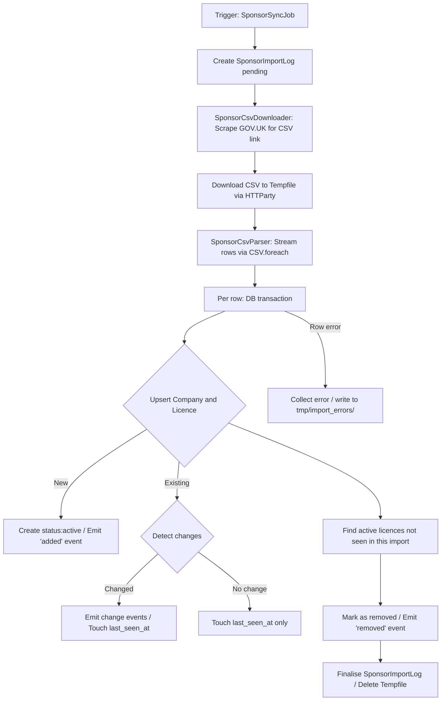

# VisaSponsorUK

VisaSponsorUK is a Ruby on Rails 8 application that tracks and monitors UK-licensed visa sponsors. It scrapes the official GOV.UK register daily, detects changes in sponsor status, and exposes a searchable interface for looking up companies and their sponsorship history.

---

## Table of Contents

- [What the App Does](#what-the-app-does)
- [Tech Stack](#tech-stack)
- [Prerequisites](#prerequisites)
- [Option A — Local Development (Recommended)](#option-a--local-development-recommended)
- [Option B — Docker Development](#option-b--docker-development)
- [Option C — Docker Production Testing](#option-c--docker-production-testing)
- [Database Commands](#database-commands)
- [Query Stats (PgHero)](#query-stats-pghero)
- [Background Jobs](#background-jobs)
- [Triggering a Sync Manually](#triggering-a-sync-manually)
- [Running Tests](#running-tests)
- [Deployment](#deployment)
- [How the Sync Pipeline Works](#how-the-sync-pipeline-works)

---

## What the App Does

| Feature | Description |
| :--- | :--- |
| **Sponsor Registry** | Searchable database of all UK companies licensed to sponsor worker visas |
| **Daily Sync** | Scrapes GOV.UK, downloads the official CSV, and diffs it against the database |
| **Change Detection** | Tracks when a sponsor is added, removed, or has its rating/type/route changed |
| **Audit Log** | Every change is recorded as a `SponsorChangeEvent` with timestamp |
| **Fuzzy Search** | PostgreSQL trigram search (`pg_trgm`) finds companies even with typos |
| **Background Jobs** | Solid Queue runs the sync at 2:00 AM daily |

---

## Tech Stack

| Layer | Technology |
| :--- | :--- |
| Language | Ruby 4.0.5 |
| Framework | Rails 8.1.3 |
| Database | PostgreSQL 16 |
| Background Jobs | Solid Queue (Rails 8 built-in) |
| Asset Pipeline | Propshaft + Tailwind CSS v4 |
| Frontend | Hotwire (Turbo + Stimulus) |
| HTTP Proxy | Thruster (production only) |
| Deployment | Kamal 2 |

---

## Prerequisites

### For local development (Option A)
- **Ruby 4.0.5** — install via [rbenv](https://github.com/rbenv/rbenv) or [rvm](https://rvm.io)
- **PostgreSQL 16+** — `brew install postgresql@16`
- **Bundler** — `gem install bundler`

### For Docker (Options B & C)
- **Docker Desktop** — [download here](https://www.docker.com/products/docker-desktop/)

---

## Option A — Local Development (Recommended)

The fastest setup. No Docker required. Code changes are reflected instantly.

### Step 1 — Install gems

```bash
bundle install
```

### Step 2 — Start PostgreSQL

```bash
brew services start postgresql@16

# Verify it's running
psql -U $USER -c '\l'
```

### Step 3 — Set up the database

```bash
bin/rails db:create db:migrate
```

### Step 4 — Start the server

```bash
bin/dev
```

This starts two processes simultaneously via [Procfile.dev](Procfile.dev):
- **Rails server** → http://localhost:3000
- **Tailwind CSS watcher** → recompiles CSS on every change

### Common local dev commands

```bash
# Rails console
bin/rails console

# Database console (psql)
bin/rails dbconsole

# Run pending migrations
bin/rails db:migrate

# Check migration status
bin/rails db:migrate:status

# Rollback last migration
bin/rails db:rollback

# Drop, recreate, migrate, seed
bin/rails db:reset

# View all routes
bin/rails routes

# Run tests
bundle exec rspec
```

---

## Option B — Docker Development

Use this when you want to run in Docker but still have **instant code reloading**.
Source code is bind-mounted so edits on your Mac appear inside the container immediately.

### Step 1 — Export master key

```bash
export RAILS_MASTER_KEY=$(cat config/master.key)
```

### Step 2 — Build and start

```bash
docker compose -f compose.yml -f compose.dev.yml up --build
```

Opens at **http://localhost:3000**

On first boot, `db:prepare` runs automatically. Edit any file in `app/`, `config/`, or `db/` and Rails reloads it automatically — no restart needed.

### Docker dev commands

```bash
# Rails console
docker compose -f compose.yml -f compose.dev.yml exec web bin/rails console

# Database console (psql)
docker compose -f compose.yml -f compose.dev.yml exec web bin/rails dbconsole

# Run pending migrations
docker compose -f compose.yml -f compose.dev.yml exec web bin/rails db:migrate

# Check migration status
docker compose -f compose.yml -f compose.dev.yml exec web bin/rails db:migrate:status

# Rollback last migration
docker compose -f compose.yml -f compose.dev.yml exec web bin/rails db:rollback

# Drop, recreate, migrate, seed
docker compose -f compose.yml -f compose.dev.yml exec web bin/rails db:reset

# Open a bash shell inside the container
docker compose -f compose.yml -f compose.dev.yml exec web bash

# View live logs
docker compose -f compose.yml -f compose.dev.yml logs -f web

# Restart the web container (re-runs db:prepare)
docker compose -f compose.yml -f compose.dev.yml restart web

# Stop everything (keeps DB data)
docker compose -f compose.yml -f compose.dev.yml down

# Stop and wipe the dev database
docker compose -f compose.yml -f compose.dev.yml down -v
```

---

## Option C — Docker Production Testing

Use this to test the **exact production Docker image** locally before deploying.

> ⚠️ Code changes require a container restart — not instant like Option B.

### Step 1 — Export master key

```bash
export RAILS_MASTER_KEY=$(cat config/master.key)
```

### Step 2 — Build and start

```bash
docker compose up --build
```

Opens at **http://localhost** (port 80, not 3000 — Thruster handles it)

### Watch mode (sync without full rebuild)

```bash
# In a second terminal — syncs file changes and restarts Puma
docker compose watch
```

### Docker prod commands

```bash
# Rails console
docker compose exec web bin/rails console

# Database console (psql)
docker compose exec web bin/rails dbconsole

# Run pending migrations
docker compose exec web bin/rails db:migrate

# Check migration status
docker compose exec web bin/rails db:migrate:status

# Rollback last migration
docker compose exec web bin/rails db:rollback

# Open a bash shell
docker compose exec web bash

# View live logs
docker compose logs -f web

# Restart web container (re-runs db:prepare)
docker compose restart web

# Stop everything (keeps DB data)
docker compose down

# Stop and wipe the production test database
docker compose down -v
```

---

## Database Commands

Quick reference for running migrations in each environment:

| Command | Local | Docker Dev | Docker Prod |
| :--- | :--- | :--- | :--- |
| Migrate | `bin/rails db:migrate` | `docker compose -f compose.yml -f compose.dev.yml exec web bin/rails db:migrate` | `docker compose exec web bin/rails db:migrate` |
| Status | `bin/rails db:migrate:status` | `docker compose -f compose.yml -f compose.dev.yml exec web bin/rails db:migrate:status` | `docker compose exec web bin/rails db:migrate:status` |
| Rollback | `bin/rails db:rollback` | `docker compose -f compose.yml -f compose.dev.yml exec web bin/rails db:rollback` | `docker compose exec web bin/rails db:rollback` |
| Reset DB | `bin/rails db:reset` | `docker compose -f compose.yml -f compose.dev.yml exec web bin/rails db:reset` | `docker compose exec web bin/rails db:reset` |

> [!NOTE]
> Containers automatically run `db:prepare` on startup. If you add a new migration **while containers are already running**, you must run `db:migrate` manually — or restart the container:
> ```bash
> # Docker dev
> docker compose -f compose.yml -f compose.dev.yml restart web
>
> # Docker prod
> docker compose restart web
> ```

### Database configuration

Settings live in [config/database.yml](config/database.yml).

| Environment | How it connects |
| :--- | :--- |
| Development | Local Postgres via `DATABASE_USERNAME` + `DATABASE_PASSWORD` env vars |
| Test | Local Postgres, database `visasponsoruk_test` |
| Production | Via `DATABASE_URL` environment variable |

For local development, create a `.env` file or export:

```bash
# Usually not needed — defaults to your Mac username with empty password
export DATABASE_USERNAME=your_postgres_username
export DATABASE_PASSWORD=your_postgres_password
```

---

## Query Stats (PgHero)

[PgHero](https://github.com/ankane/pghero) is mounted at `/pghero` and gives visibility into slow/frequent queries. It relies on Postgres's `pg_stat_statements` extension, which is **not enabled by default** and requires a one-time setup per environment.

> [!NOTE]
> `shared_preload_libraries` only takes effect after a Postgres **restart**, not just `CREATE EXTENSION`. The steps below account for that.

### Docker Dev / Docker Prod Testing

The `postgres` service in [compose.yml](compose.yml) already sets `command: postgres -c shared_preload_libraries=pg_stat_statements`, so a normal `up` picks it up. If you're enabling this for the first time on an existing container, force it to recreate:

```bash
# Recreate Postgres so the new command takes effect
docker compose -f compose.yml -f compose.dev.yml up -d --force-recreate postgres

# Create the extension (swap db name for _production if using Option C)
docker compose -f compose.yml -f compose.dev.yml exec postgres \
  psql -U visasponsoruk -d visasponsoruk_development -c "CREATE EXTENSION IF NOT EXISTS pg_stat_statements;"

# Run the pghero_query_stats table migration
docker compose -f compose.yml -f compose.dev.yml exec web bin/rails db:migrate

# Capture stats manually
docker compose -f compose.yml -f compose.dev.yml exec web bin/rails pghero:capture_query_stats
```

For Option C (no `compose.dev.yml` override), drop the `-f compose.dev.yml` flag from each command.

### Production (Kamal)

Postgres runs as a Kamal accessory ([config/deploy.yml](config/deploy.yml)), which also sets `cmd: postgres -c shared_preload_libraries=pg_stat_statements`.

```bash
# Recreates the postgres accessory container (data persists — it's a host bind mount)
kamal accessory reboot postgres

# Create the extension (--reuse runs it in the existing running container, not a throwaway one)
kamal accessory exec postgres -i --reuse "psql -U visasponsoruk -d visasponsoruk_production -c 'CREATE EXTENSION IF NOT EXISTS pg_stat_statements;'"

# Run the pghero_query_stats table migration
kamal app exec --reuse "bin/rails db:migrate"

# Capture stats manually
kamal app exec --reuse "bin/rails pghero:capture_query_stats"
```

> ⚠️ `kamal accessory reboot` briefly stops and recreates the Postgres container. Data on disk is untouched (bind-mounted), but expect a few seconds of DB downtime.

### Automatic capture

Once enabled, stats are captured automatically every 30 minutes via Solid Queue — see [Recurring schedule](#recurring-schedule) below. No further action needed after the one-time setup.

---

## Background Jobs

Jobs use **Solid Queue** — stored in the primary PostgreSQL database (no Redis required).

### Queue configuration

[config/queue.yml](config/queue.yml): 3 worker threads, 0.1s poll interval.

### Recurring schedule

[config/recurring.yml](config/recurring.yml):
- `sponsor_sync` — runs `SponsorSyncJob` at **2:00 AM daily**
- `clear_solid_queue_finished_jobs` — cleans finished jobs **every hour**
- `pghero_capture_query_stats` — captures PgHero query stats **every 30 minutes** (requires `pg_stat_statements` — see [Query Stats (PgHero)](#query-stats-pghero))

### Workers

In development, Solid Queue runs inside Puma automatically. To start manually:

```bash
bundle exec rake solid_queue:start
```

---

## Triggering a Sync Manually

### Via Rails console

```ruby
# Queue as a background job
SponsorSyncJob.perform_later

# Run synchronously (useful for debugging)
SponsorImporter.call
```

### Via command line

```bash
bin/rails runner "SponsorSyncJob.perform_later"
```

### Error logs

If any CSV rows fail during sync, error details are written to:
```
tmp/import_errors/errors_[log_id]_[timestamp].csv
```

---

## Running Tests

```bash
# Run all specs
bundle exec rspec

# Run a specific file
bundle exec rspec spec/models/company_spec.rb

# Run with documentation format
bundle exec rspec --format documentation

# Security audit (check gems for known CVEs)
bundle exec bundler-audit check --update

# Static analysis for security vulnerabilities
bundle exec brakeman -q
```

---

## Deployment

Deployment uses **Kamal 2** onto a DigitalOcean Droplet with PostgreSQL running as a Docker accessory container on the same server.

```bash
# Export secrets on your local machine before deploying
export KAMAL_REGISTRY_PASSWORD="your_docker_hub_password"
export DB_PASSWORD="your_db_password"
export HTTP_USERNAME="your_pghero_dashboard_username"   # protects /pghero with HTTP Basic Auth
export HTTP_PASSWORD="your_pghero_dashboard_password"

# First-time server setup (installs Docker, starts all containers)
kamal setup

# Deploy new code
git push && kamal deploy

# View live server logs
kamal logs

# Rollback to previous release
kamal rollback
```

### Production Troubleshooting & Operations

#### 1. Running the Rails Console in Production
* **From your local machine (via Kamal):**
  ```bash
  kamal app exec -i --reuse "bin/rails console"
  ```
* **Directly inside the Droplet (via SSH):**
  ```bash
  # First list running containers to find the web container name
  docker ps
  
  # Then run the console inside it
  docker exec -it <container_name> bin/rails console -e production
  ```

#### 2. Checking Droplet RAM and Disk Usage
* **Disk Space (run inside SSH):**
  ```bash
  df -h
  ```
  *(Look for `/` mounted partition).*
* **RAM/Memory Usage (run inside SSH):**
  ```bash
  free -h
  ```
* **Docker Container RAM/CPU Stats (run inside SSH):**
  ```bash
  docker stats
  ```
  *(Lists resource usage for all running containers).*

---

## How the Sync Pipeline Works



### Key services

| File | Responsibility |
| :--- | :--- |
| [app/services/sponsor_importer.rb](app/services/sponsor_importer.rb) | Orchestrates the entire sync pipeline |
| [app/services/sponsor_csv_downloader.rb](app/services/sponsor_csv_downloader.rb) | Scrapes GOV.UK and downloads the CSV |
| [app/services/sponsor_csv_parser.rb](app/services/sponsor_csv_parser.rb) | Streams and parses CSV rows |
| [app/jobs/sponsor_sync_job.rb](app/jobs/sponsor_sync_job.rb) | Active Job wrapper for async execution |
| [app/models/company.rb](app/models/company.rb) | Fuzzy search via PostgreSQL trigram index |
