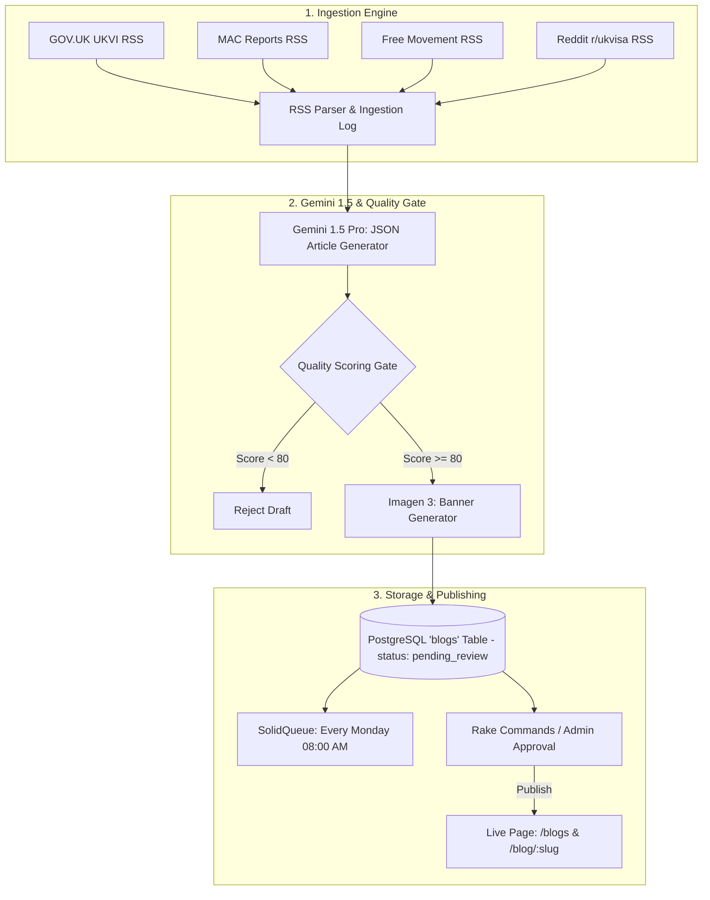

# Automated Weekly Blog Publishing System Documentation

This document provides a comprehensive guide to the **Automated Weekly Blog System** in **VisaSponsorCheck**, powered by **Google Gemini 1.5 API**, **Imagen 3**, multi-source RSS ingestion, database storage, and deterministic **Anti-AI-Slop quality controls**.

---

## 1. System Overview & Architecture



---

## 2. Key Components & File Locations

| Component | Path | Description |
| :--- | :--- | :--- |
| **Blog Model** | [`app/models/blog.rb`](../app/models/blog.rb) | Database model, validations, scopes, and slug generator |
| **Ingestion Log** | [`app/models/blog_ingestion_log.rb`](../app/models/blog_ingestion_log.rb) | Deduplication registry preventing duplicate article generation |
| **Generator Service** | [`app/services/blog_generator_service.rb`](../app/services/blog_generator_service.rb) | Ingestion parser, Gemini API wrapper, quality gate, Imagen 3 generator |
| **SolidQueue Job** | [`app/jobs/weekly_blog_ingestion_job.rb`](../app/jobs/weekly_blog_ingestion_job.rb) | Background job for scheduled weekly execution |
| **Schedule Config** | [`config/recurring.yml`](../config/recurring.yml) | SolidQueue cron schedule (`at 8am every Monday`) |
| **Rake Tasks** | [`lib/tasks/blog.rake`](../lib/tasks/blog.rake) | Terminal CLI for generation, pending draft review, and publishing |
| **Controllers & Views** | [`app/controllers/blogs_controller.rb`](../app/controllers/blogs_controller.rb)<br>[`app/views/blogs/`](../app/views/blogs/) | Public blog index, detail view, SEO meta tags, and JSON-LD schema |

---

## 3. Rails Credentials & Setup

Configure your API key in Rails credentials (`bin/rails credentials:edit`):

```yaml
gemini:
  api_key: "your-google-gemini-api-key"
```

---

## 4. How Ingestion & Generation Runs

### Automatic Weekly Schedule (Production)
The system automatically executes every Monday at **08:00 AM UTC** via SolidQueue:
1. `WeeklyBlogIngestionJob` runs.
2. Ingests raw news from UKVI, MAC, and legal RSS feeds.
3. Checks `blog_ingestion_logs` to ensure no duplicate stories are generated.
4. Gemini 1.5 Pro generates the JSON article payload under strict anti-slop rules.
5. The **Quality Gate** scores the post. If score $\ge 80$, Imagen 3 generates the featured 16:9 banner art.
6. The blog post is saved to the PostgreSQL database with `status: "pending_review"`.

---

## 5. Terminal Commands (CLI Workflow)

You can manage the blog pipeline directly from the command line using custom Rake tasks:

### Generate a Blog Post On-Demand
```bash
bin/rails blog:generate
```

### List Pending Drafts Awaiting Review
```bash
bin/rails blog:pending
```

### Publish the Latest Pending Draft
```bash
bin/rails blog:publish_latest
```

### Publish a Specific Draft by ID or Slug
```bash
bin/rails blog:publish[1]
# or
bin/rails blog:publish[sponsor-licence-audit-checklist-2026]
```

---

## 6. Anti-AI-Slop Quality Gate Criteria

To prevent generic AI fluff, the `BlogGeneratorService` evaluates every generated draft against a **100-point quality scale**:

1. **Banned Cliché Penalties (-15 pts per occurrence)**:
   * Penalizes terms like: `delve into`, `tapestry`, `beacon`, `testament to`, `in today's fast-paced world`, `game-changer`, `it is important to note`, `in conclusion`, `furthermore`.
2. **Data Density Requirement (-15 pts if < 5 figures)**:
   * Requires at least 5 explicit dates, monetary figures (£), SOC codes, or Home Office guidance paragraph numbers.
3. **HTML Element Hierarchy (-20 pts if missing)**:
   * Must contain structured `<h2>`, `<h3>`, and `<ul>` list elements.
4. **Depth Requirement (-20 pts if < 400 words)**:
   * Ensures thorough, authoritative legal coverage rather than superficial summaries.

> Articles scoring **< 80/100** fail the quality gate and are rejected before saving.

---

## 7. Running RSpec Tests

To verify the blog models, quality gate scoring, background jobs, and HTTP endpoints:

```bash
bundle exec rspec spec/models/blog_spec.rb spec/services/blog_generator_service_spec.rb spec/requests/blogs_spec.rb spec/jobs/weekly_blog_ingestion_job_spec.rb
```
